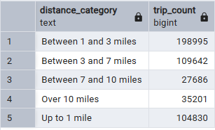

### Question 3

> During the period of October 1st 2019 (inclusive) and November 1st 2019 (exclusive), how many trips, respectively, happened:

* Up to 1 mile
* In between 1 (exclusive) and 3 miles (inclusive),
* In between 3 (exclusive) and 7 miles (inclusive),
* In between 7 (exclusive) and 10 miles (inclusive),
Over 10 miles

> Solution

```sql
SELECT 
	CASE
		WHEN trip_distance <= 1 THEN 'Up to 1 mile'
		WHEN trip_distance > 1 and trip_distance <= 3 THEN 'Between 1 and 3 miles'
		WHEN trip_distance > 3 and trip_distance <= 7 THEN 'Between 3 and 7 miles'
		WHEN trip_distance > 7 and trip_distance <= 10 THEN 'Between 7 and 10 miles'
		ELSE 'Over 10 miles'
	END AS distance_category,
	COUNT(*) AS trip_count
FROM taxi_trips
WHERE 
	lpep_pickup_datetime >= '2019-10-01'
	and lpep_pickup_datetime < '2019-11-01'
GROUP BY 1
ORDER BY 1
```

> output



---


